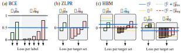

# HBM loss

This repository contains code for the ACL24 (findings) paper: [Hierarchy-aware Biased Bound Margin Loss Function for Hierarchical Text Classification
](https://openreview.net/forum?id=CBSohZD84m)

Keywords: Hierarchical Text Classification, Classification Loss, Label Imbalance

TL;DR: This paper presents the Hierarchy-aware Biased Bound Margin (HBM) loss, a novel approach for unit-based hierarchical text classification models, addressing static thresholding and label imbalance.



## Download data
Move the downloaded data to ```./data/{dataset name}/raw``` according to the license of each dataset.

## Data Preprocess
- RCV1-v2

    ```bash
    python src/preprocess.py \
            --name=RCV1v2 \
            --raw_dir={raw_data_dir} \
            --save_dir={save_dir}
    ```
- NYT
    ```bash
    python src/preprocess.py \
            --name=NYT \
            --raw_dir={raw_data_dir} \
            --save_dir={save_dir}
    ```
- EURLEX57K
    ```bash
    python src/preprocess.py \
            --name=EURLEX57K \
            --raw_dir={raw_data_dir} \
            --save_dir={save_dir}  \
            --hierarchy_file={EURLEX57K.json file path}
    ```
    + run ```HBM-loss-for-HTC/src/preprocess/tree.ipynb``` to create DAG to Tree hierarchy file

## Caching data

- Train data
    ```bash
    python src/dataset/caching.py data=NYT stage=TRAIN
    ```

- Val data
    ```bash
    python src/dataset/caching.py data=EURLEX57K stage=VAL
    ```

- Test data with num_workers=4, chunk_size=100000
    ```bash
    python src/dataset/caching.py data=RCV1v2 stage=TEST num_workers=4 chunk_size=100000
    ```

- or Run ```caching.sh```

## Training model with HBM loss

- in RCV1v2, with no log_skip

    ```bash
    python main.py data=RCV1v2 name=HiDEC-HBM trainer.log_skip=0
    ```

- in NYT, devices=[0,1]

    ```bash
    python main.py data=NYT name=HiDEC-HBM devices=01
    ```

- in EURLEX57K with wandb logger

    ```bash
    python main.py data=EURLEX57K name=HiDEC-HBM logger=wandb
    ```

## Inference model
- with best model

    ```bash
    python main.py data=EURLEX57K name=HiDEC-HBM do_train=false
    ```

- with specific model weight
    
    ```bash
    python main.py data=EURLEX57K name=HiDEC-HBM do_train=false ckpt_path={~.ckpt file path}
    ```

## Main table


| Model | RCV1v2 Micro-F1 | RCV1v2 Macro-F1 | NYT Micro-F1 | NYT Macro-F1 | EURLEX57K Micro-F1 | EURLEX57K Macro-F1 |
|------------|----------|-----------|--------|----------|---------|--------|
|  [HPT](https://aclanthology.org/2022.emnlp-main.246/) (ZLPR) | 87.26 | 69.53 | 80.42 | **70.42** | - | - |
| [HiDEC](https://ojs.aaai.org/index.php/AAAI/article/view/26520) (BCE) | **87.96** | 69.97 | 79.99 | 69.64 | **75.29** | - |

| HPT | RCV1v2 Micro-F1 | RCV1v2 Macro-F1 | NYT Micro-F1 | NYT Macro-F1 | EURLEX57K Micro-F1 | EURLEX57K Macro-F1 |
|-------|----------|-----------|--------|----------|---------|--------|
| with BCE  | 87.65±0.11 | 69.87±0.40 | 79.49±0.22 | 68.66±0.30 | 71.57±0.58 | 25.34±0.59 |
| with ZLPR | **87.82**±0.14 | 70.23±0.31 | 80.04±0.23 | 69.69±0.49 | 75.54±0.20 | 28.46±0.26 |
| with **HBM**  | **87.82**±0.06 | **70.55**±0.13 | **80.42**±0.12 | **70.23**±0.18 | **75.78**±0.15 | **28.70**±0.22 |

| HiDEC | RCV1v2 Micro-F1 | RCV1v2 Macro-F1 | NYT Micro-F1 | NYT Macro-F1 | EURLEX57K Micro-F1 | EURLEX57K Macro-F1 |
|-------|----------|-----------|--------|----------|---------|--------|
| with BCE   | 87.70±0.12 | 70.82±0.20 | 80.13±0.16 | 69.80±0.24 | 75.14±0.19 | 27.91±0.11 |
| with ZLPR  | 87.59±0.18 | 70.61±0.36 | 80.25±0.21 | 70.14±0.23 | 76.16±0.16 | 28.68±0.15 |
| with **HBM**   | **87.81**±0.09 | **71.47**±0.20 | **80.52**±0.18 | **70.69**±0.19 | **76.48**±0.12 | **28.77**±0.11 |


## Cite

```bigquery
update soon
```